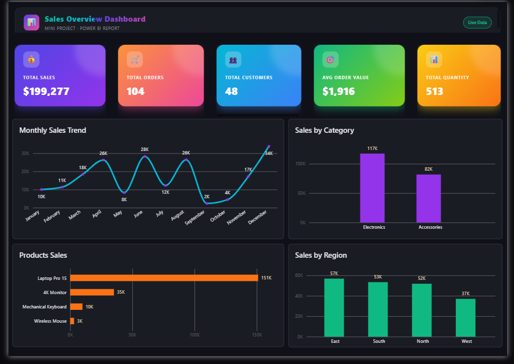

<div align="center">

# 📊 Mini Project  
### First Power BI Report: Sales Overview


**Interactive Sales Dashboard built with Power BI**

</div>

---

## 📝 Description

This mini project focuses on creating an interactive **Sales Overview** report using **Power BI**.  
The goal is to transform raw sales data into clear, actionable insights through professional visualizations and dashboards that help decision-makers understand performance at a glance.

---

## 🎯 Objectives

- [x] Import and clean sales data
- [x] Create key measures and calculated columns (Total Sales, Profit, Quantity, etc.)
- [x] Design an interactive Sales Overview dashboard
- [x] Add filters, slicers, and drill-through capabilities
- [x] Extract meaningful business insights from the data

---

## 📂 Project Structure

```text
mini-project/
├── Raw_Sales_Data/                 # Raw & cleaned datasets
├── mini project/                 # Power BI report file (.pbix)
├── Final-Dashboard/          # Dashboard screenshots
└── README.md             # This file
```
---

## 🛠️ Tools & Libraries

- Power BI
- Power Query
- DAX
---

## 📈 Results & Insights


---

## 👥 Contributors

- Ahmed Fakher
- Amira Adel
- Esraa Badr
- Mariam Skoot
- Ali Abdelsalam

---
<div align="center">

**Team2: Data Miners** • Mini Project

</div>
